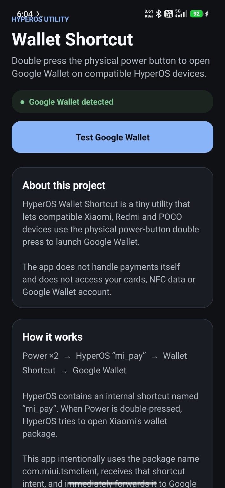
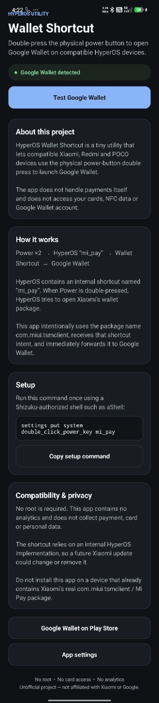

# HyperOS Wallet Shortcut

Open Google Wallet by double-pressing the physical power button on compatible HyperOS devices.

> Unofficial open-source project. Not affiliated with Xiaomi or Google.

<p align="center">
  
</p>

## About

HyperOS Wallet Shortcut is a small Android utility that enables the physical power-button double-press shortcut to launch Google Wallet on compatible Xiaomi, Redmi and POCO devices.

It does not process payments and does not access your cards, NFC data, Google account, or Google Wallet data.

## How it works

HyperOS contains an internal shortcut named `mi_pay`.

When the power button is double-pressed, HyperOS attempts to launch Xiaomi's wallet package:

`com.miui.tsmclient`

This app intentionally uses that package name, receives HyperOS' wallet shortcut intent, and immediately forwards it to Google Wallet.

**Power ×2 → HyperOS `mi_pay` → HyperOS Wallet Shortcut → Google Wallet**

## Requirements

- Compatible Xiaomi / Redmi / POCO device running HyperOS
- Google Wallet installed
- Shizuku
- A Shizuku-compatible shell such as aShell
- Xiaomi's real `com.miui.tsmclient` / Mi Pay package must **not** already be installed

## Installation

1. Download the latest APK from the [Releases](../../releases/latest) page.
2. Install the APK.
3. Start Shizuku.
4. Open aShell and grant Shizuku access.
5. Run:

```sh
settings put system double_click_power_key mi_pay
```

6. Double-press the physical power button.

Google Wallet should open.

## App preview

<p align="center">
  
</p>

The app includes:

- Google Wallet detection
- Test Google Wallet button
- Setup instructions
- Copy setup command button
- Light and dark mode
- Explanation of how the shortcut works
- Compatibility and privacy information

## Privacy

HyperOS Wallet Shortcut:

- Has no analytics
- Has no ads
- Does not access payment cards
- Does not access NFC payment data
- Does not access your Google account
- Does not require root

The app only receives the HyperOS shortcut intent and launches Google Wallet.

## Compatibility

This project relies on an internal HyperOS implementation and may stop working if Xiaomi changes the shortcut system in a future update.

Do not install this application on devices where Xiaomi's real Mi Pay / `com.miui.tsmclient` package is already installed.

## Why does the package name look like Xiaomi Mi Pay?

HyperOS specifically targets `com.miui.tsmclient` when the `mi_pay` shortcut is triggered.

Using this package name is therefore required for the shortcut to work.

## Security

The source code is intentionally small so the behavior of the application can be easily inspected.

Never install APKs claiming to be this project from unofficial sources.

## License

Apache License 2.0
