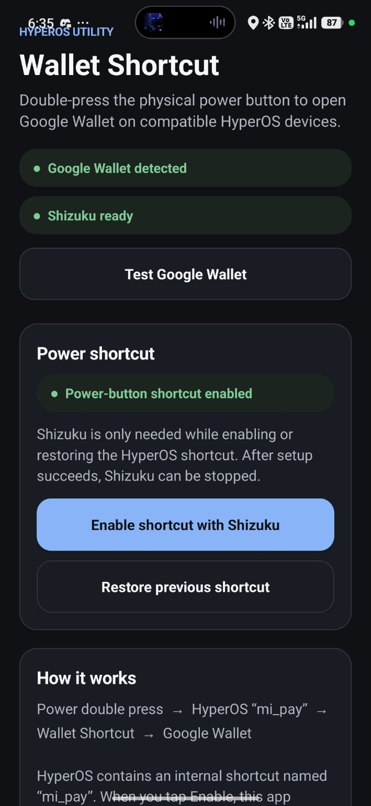
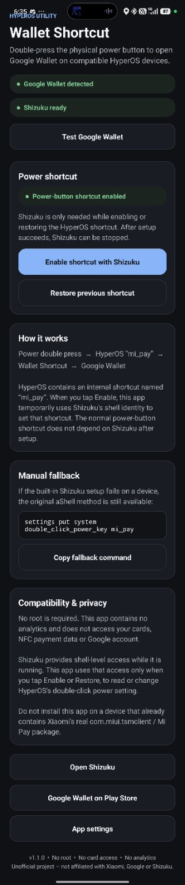

# HyperOS Wallet Shortcut

A rootless HyperOS utility that lets compatible Xiaomi, Redmi and POCO devices open **Google Wallet** by double-pressing the physical power button.

> **Unofficial project.** Not affiliated with Xiaomi, Google, or Shizuku.

<p align="center">
  
</p>

## About

HyperOS Wallet Shortcut is a small compatibility shim for HyperOS devices where the physical power-button double press cannot normally be assigned to Google Wallet.

It uses HyperOS's internal `mi_pay` shortcut path and forwards that shortcut to Google Wallet.

The app does **not** handle payments itself and does not access your cards, NFC payment data, or Google account.

## What's new in v1.1.0

v1.1.0 adds built-in **Shizuku setup**, so normal users no longer need to install aShell or manually paste the setup command.

- Enable the HyperOS shortcut directly from the app.
- Restore the previous power-button shortcut.
- See whether Shizuku is running and ready.
- See whether the Wallet shortcut is currently enabled.
- Keep the original aShell command as a manual fallback.
- Shizuku only needs to run while enabling or restoring the shortcut.

After setup succeeds, you can stop Shizuku. The power-button shortcut itself does not depend on Shizuku staying active.

## How it works

```text
Power ×2
   ↓
HyperOS "mi_pay"
   ↓
HyperOS Wallet Shortcut
   ↓
Google Wallet
```

HyperOS contains an internal shortcut named `mi_pay`. When that shortcut is selected, HyperOS attempts to launch Xiaomi's wallet package.

This app intentionally uses the package name:

```text
com.miui.tsmclient
```

It receives the HyperOS wallet shortcut and immediately forwards it to Google Wallet.

For setup, v1.1.0 temporarily uses Shizuku's shell-level access to configure:

```text
double_click_power_key = mi_pay
```

Once that setting has been written, Shizuku can be stopped.

## Requirements

- A compatible Xiaomi, Redmi, or POCO device running HyperOS.
- Google Wallet installed.
- Shizuku installed and running during setup.
- No root required.

## Installation

1. Download the latest APK from the **Releases** page.
2. Install the APK.
3. Start **Shizuku**.
4. Open **HyperOS Wallet Shortcut**.
5. Tap **Enable shortcut with Shizuku**.
6. Grant the app Shizuku permission when prompted.
7. Wait for the app to confirm that the shortcut was enabled.
8. You can now stop Shizuku.
9. Double-press the physical power button to open Google Wallet.

## Restoring your previous shortcut

If the app saved a previous double-press action before enabling Wallet:

1. Start Shizuku.
2. Open HyperOS Wallet Shortcut.
3. Tap **Restore previous shortcut**.
4. The previously saved HyperOS shortcut value will be restored.

## Manual fallback

If the built-in Shizuku setup does not work on a particular device, you can still use the original method.

Run the following command from a Shizuku-authorized shell such as aShell:

```sh
settings put system double_click_power_key mi_pay
```

You only need to run it once unless HyperOS later resets or changes the setting.

To verify the current value:

```sh
settings get system double_click_power_key
```

Expected result:

```text
mi_pay
```

## App preview

<p align="center">
  
</p>

## Features

- Double-press Power to launch Google Wallet.
- Rootless operation.
- Built-in Shizuku setup.
- One-tap shortcut enable.
- Restore previous shortcut.
- Shortcut status detection.
- Google Wallet detection.
- Manual aShell fallback.
- No background service required after setup.
- No analytics.
- No card or payment-data access.

## Privacy

HyperOS Wallet Shortcut does not collect analytics or personal information.

The app does not read or store:

- payment cards
- NFC payment data
- Google Wallet account information
- Google account credentials

Shizuku provides shell-level access while it is running. HyperOS Wallet Shortcut uses that access only when you explicitly tap **Enable shortcut with Shizuku** or **Restore previous shortcut**, in order to read or change the HyperOS double-click power setting.

## Compatibility

The shortcut relies on an internal HyperOS implementation and is therefore not guaranteed to work on every Xiaomi, Redmi, or POCO model.

A future HyperOS update may change or remove the internal shortcut behavior.

If you test the app on another device, compatibility reports are welcome. Useful information includes:

- device model
- HyperOS version
- Android version
- whether Power ×2 successfully opened Google Wallet

## Important package-name warning

This project intentionally uses Xiaomi's Mi Pay package name:

```text
com.miui.tsmclient
```

This is required because HyperOS routes the internal `mi_pay` shortcut to that package.

**Do not install this app if your device already has Xiaomi's real `com.miui.tsmclient` / Mi Pay package installed.**

Only one installed app can own a package name at a time.

## Why Shizuku is needed

Android's normal `WRITE_SETTINGS` permission is not enough for this HyperOS shortcut setting.

On affected HyperOS builds, attempting to change `double_click_power_key` through the normal app API is redirected/protected as a secure system setting.

Shizuku allows the app to perform the same settings operation through Android's shell identity without requiring root.

## Security

The source code is public so the behavior of the app can be inspected.

The app's privileged setup path is intentionally limited to the HyperOS power-button shortcut configuration. The normal Power ×2 → Google Wallet flow does not require Shizuku to remain running.

If you find a security issue, please follow the instructions in [`SECURITY.md`](SECURITY.md).

## Building

This repository contains the Android source code and Gradle configuration.

The project currently targets:

```text
compileSdk 35
minSdk 23
targetSdk 35
```

Shizuku API integration is included in the app source.

Official releases are signed separately. Do not commit signing keys or keystores to the repository.

## License

Licensed under the **Apache License 2.0**.

See [`LICENSE`](LICENSE) for the full license text.
